# PROMPT.md — LLM brief for segfault

This document is the source of truth for any LLM that generates scripts,
storyboards, asset prompts, branded scene specs, or any other artifact that
ends up on screen. Read it once before generating, then internalise it.

If something here conflicts with a hardcoded prompt string in
`src/server/queue/pipeline.ts`, **this document wins**. Update the prompt
strings to match.

---

## 1. What we're making

YouTube-style explainer videos: 60–180s, voice-narrated, **fast-cut** pacing
(many short scenes, not long static slides). Each video is composed
scene-by-scene from a small set of templates and rendered by Remotion
(React). The visual language is **warm-minimal**:
a charcoal sheet with a single coral/terracotta accent and a paper-white
block as the brand mark. Influences are diffs.com / Linear / Vercel / Geist
for the type and density, but the palette is warmer and the accent is
coral, not indigo. **Not** Fireship rainbow gradients. **Not** clipart.

> Tagline for the brand: *"a developer-tool aesthetic explaining a
> developer-tool concept."*

> Brand mark: paper-white square + a curved coral L overlapping its
> lower-left corner, on a charcoal canvas. Treat the L as the only true
> colour in the system.

---

## 2. Design system

The renderer applies these tokens automatically (`src/remotion/spec/design.ts`).
You should write content that flatters them, not that fights them.

### Surface

- Background: warm near-flat charcoal (`#1a1614 → #141110`) with a faint
  coral wash up top. **Do not** propose colourful gradient scene
  backgrounds — they get normalised to the flat token at render time.
- Borders: 1px hairline `rgba(255,248,240,0.08)`. No drop shadows, no glows.
- Cards: `transparent` background with a hairline border. Active emphasis is
  a faint coral wash (`rgba(217,124,117,0.07)`) plus a brighter border.

### Color

There is **one** accent: coral (`#d97c75` / `#e8a7a1` / `rgba(217,124,117,*)`).
Everything else is warm zinc grey or paper white (`#fafafa`, `#f7f3ee`).
Do not introduce additional brand colours in your scene content; the
renderer will ignore them.

### Typography

- **Sans**: Inter / Geist (UI body, headlines).
- **Mono**: Geist Mono / JetBrains Mono (code, list numbers, scene counter,
  technical primitives).
- Weights: 400/500/600/700. Never 800/900 — that reads as "Fireship".
- Tight tracking: `letter-spacing: -0.02em` for display, `-0.005em` for body.

### Iconography

- Icons come from **Lucide** only (`src/remotion/spec/icon-map.ts`).
- They render at 1.6 stroke width, in soft coral (`#e8a7a1`) inside a ghost
  tile — never filled with rainbow gradients.
- **Do not decorate titles with icons.** Titles and stat callouts render as
  pure type. The renderer ignores `iconName` on `type: "text"` elements —
  set it to `null`. Icons are still used inside diagrams (`type: "icon"`
  tiles, and the inferred icons inside Mermaid nodes).

---

## 3. Layout & composition

The renderer (`VideoFromSpec.tsx`) places each scene into one of four
layouts. You influence which one via the **`template`** field on the
branded scene spec.

### Pacing — scene switches (read this first)

Videos should **cut often**. Viewers should feel rhythm, not a slide deck.

| Scene type | Target length | Rule |
| ---------- | ------------- | ---- |
| List, image, stat, quote, code-only | **2.5–5 s** | One idea, then cut. ~8–18 spoken words. |
| Diagram-hop walkthrough | **5–12 s** | **One** scene; multiple `focusBeats` with `target: "diagram"` and shifting `mermaidTargets`. Motion = the cut. |
| Everything else | **2.5–5 s** | If narration needs >5s on a static layout, **split into two scenes**. |

**Scene count vs duration** (planning): aim for `round(durationSeconds / 4.5)`
scenes, minimum 12 for a 60s video. A 90s video should land around **18–22
scenes**, not 8.

**Do not** reuse the same static screen for multiple spoken beats unless
you are diagram-hopping inside that scene.

### Layout rules

- **Outer margins are large by design** (~9% of canvas). Don't try to fight
  them by stuffing more content per scene — **split into another scene**
  instead of adding bullets.
- **One clear idea per scene.** A scene answers one question, shows one
  flow, or makes one comparison — then **cut**.
- **Single-element scenes are always centred** in the canvas. Don't worry
  about positioning.
- **Two-element scenes** (text + visual) become a split layout: text island
  on one side, visual island on the other, with a wide gutter between.
- Text is always **left-aligned inside a centred island** (Linear-style).
  Lists and paragraphs hug each other; the whole stack sits centred in its
  pane. Never propose centre-aligned body text.

### Available templates (`BrandedSceneTemplate`)

| Template                    | Use when…                                                    |
| --------------------------- | ------------------------------------------------------------ |
| `left_diagram_right_text`   | The flow IS the point. Diagram on the left, narration right. |
| `right_diagram_left_text`   | Same, mirrored — alternate so the eye moves.                 |
| `list`                      | Hook, summary, "three things to check" beats.                |
| `image`                     | A real product / logo / screenshot is the cleanest visual.   |
| `image_hero`                | Big image, short caption. Use for brand reveals.             |
| `image_left`                | Image card paired with a text panel.                         |
| `code_focus`                | Real code OR pseudo-code for an algorithm — use freely.      |
| `stat_callout`              | Single huge number / word. Use sparingly for impact.         |
| `quote`                     | Short pull-quote, optionally attributed.                     |

**Vary the template every scene** — never the same template twice in a row.
Three diagram *templates* in a row is boring unless the middle one is a
diagram-hop (same graph, new `mermaidTargets`). A typical **90s / ~20-scene**
arc might read: `stat_callout → list → image_hero → left_diagram_right_text
(diagram-hop 8s) → image → list → right_diagram_left_text → stat_callout →
quote → image_left → list → …` — many quick beats, one longer hop scene.

---

## 4. Visual element priority

When a scene needs a visual, the renderer picks **in this order**:

1. **React-drawn diagram** (the LLM's Mermaid, redrawn in our ghost-tile
   style). **Whenever you emit a parseable `diagramMermaid`, it wins.**
   Diagrams carry labelled structure that no stock screenshot can match.
2. **Downloaded image** (logo, screenshot, photo) — used when no diagram
   was authored for the scene.
3. **Stock image fallback** (the downloaded image, if any, used as fallback
   when Mermaid parsing fails).
4. **Raw Mermaid** (last resort — it'll look out of place).

### Implication for your prompts

- **Diagrams beat images, always.** If a scene benefits from a labelled
  flow at all, write a `diagramMermaid` for it — don't emit one *and* an
  image hoping the image wins. It won't. Use `focusBeats[].mermaidTargets`
  to walk the viewer through the diagram one node at a time (see §9).
- **Use images when there is no flow.** Brand reveals, product
  screenshots, photographic mood beats, and named-thing reveals (Claude,
  OpenAI, React, AWS, Postgres, Vercel, GitHub, Linear, ChatGPT, Docker,
  Stripe, …) → set `template` to `image` / `image_hero` / `image_left`
  with a tight `imageSearchQuery`, and leave `diagramMermaid` empty.
- **Lists for "the three pillars of X."** Don't draw a diagram for
  enumerated concepts — that's a `list`.

---

## 5. Writing `imageSearchQuery`

This becomes a Google Images query via SerpAPI. The cleaner the query, the
better the result.

**Do:**
- `Claude AI logo`
- `ChatGPT interface screenshot`
- `AWS Lambda logo`
- `Vercel dashboard ui`
- `Postgres logo transparent`
- `Linear app screenshot dark`

**Don't, ever:**
- Append `stock photo`, `stock image`, `royalty free`, `HD`, `4k`, or any
  SEO filler. These rank watermarked Shutterstock thumbnails first — which
  we cannot download, period.
- Use generic phrases like `business meeting`, `developer working`,
  `team collaboration`. They return generic stock and we have to throw them
  away.
- Mention abstract ideas (`scalability illustration`). Name the concrete
  thing instead.

If a scene's subject genuinely has no good real-world image (e.g. an
abstract architecture pattern), drop the image and reach for a diagram or
a list/quote/stat instead.

---

## 6. Writing `diagramMermaid`

Only emit Mermaid when a diagram is genuinely the point. Keep it inside the
re-renderable subset:

**Allowed:**
- `flowchart LR` and `flowchart TB`
- Nodes: `A["Label"]`, `B("Rounded")`, `C{"Diamond"}`, `D[("Cylinder")]`
- Edges: `-->`, `--> |label|`, `---`, `-.->`, `==>`
- `subgraph GroupId [Title]` … `end` — wraps its member nodes in a labelled
  hairline rectangle. **Use this for architecture diagrams** (cloud groups,
  microservices boundaries, network zones, layers). Subgraphs can nest.
- `classDef` with `class A,B name;` — used by `focusBeats.mermaidTargets`
  to highlight the currently-explained node. Keep `classDef` names readable
  (`active`, `muted`, `primary`) — the renderer maps them to emphasis levels.

**Forbidden (will fall back to image or skip the scene):**
- `sequenceDiagram`, `stateDiagram-v2`, `classDiagram`, `erDiagram`,
  `gantt`, `pie`, `journey`, `mindmap`, `architecture-beta`.
- More than ~24 nodes total (gets cramped and ugly at 1080p).
- Custom `style` / `linkStyle` colors — the renderer ignores them and
  applies its own palette. Use `class` + `classDef` instead.

**Architecture diagram example** (this WILL render as a clean ghost-tile
flow with a labelled "VPC" box around the inner services):

```mermaid
flowchart LR
  User["User"] --> LB["Load Balancer"]
  subgraph vpc [VPC]
    LB --> API["API Server"]
    API --> Cache[("Redis")]
    API --> DB[("Postgres")]
  end
  API --> S3[("S3 Bucket")]
  classDef hi fill:#000,stroke:#000;
  class API hi;
```



**Walkthroughs:** if you reuse the same topology across consecutive scenes
to walk the viewer through it, keep stable IDs and use
`focusBeats[].mermaidTargets` to point at the currently-explained nodes.
The renderer will dim everything else.

---

## 7. Writing the script

This is where most of the value lives. Narration is **spoken**, not read.

### Narration (`narration`, `hook`, `fullNarration`)

- **Short sentences.** One idea per beat. A viewer listening once should
  follow without rewinding.
- **Plain language for the audience level.** `BEGINNER` means no
  unexplained acronyms. `EXPERT` can be denser but still listenable.
- **No meta about the video itself.** Forbidden phrases:
  - "as you can see in the diagram"
  - "on the right of the screen"
  - "we're highlighting"
  - "this flowchart shows"
  - "in this animation"
  - "in this Mermaid diagram"
  - Any reference to `Mermaid`, `Lucide`, `Remotion`, `React`, the rendering
    tooling, or production process.
- **Refer to real parts of the system.** "When a request hits the gateway"
  — not "this box here".

### Audio tags (ElevenLabs v3)

The narration is synthesised with ElevenLabs `eleven_v3`, which understands
inline audio-direction tags. Use them sparingly to make delivery feel
human — one tag per ~25 spoken words is the right density. Tags go
**before** the sentence they shape.

Allowed inline tags:

```
[laughs] [chuckles] [sighs] [exhales]
[whispers] [shouts]
[excited] [curious] [thoughtful] [amazed] [disappointed]
[sarcastic] [deadpan] [warm] [serious] [matter-of-fact]
```

Allowed pause: `<break time="0.4s"/>` (clamped to 0.1–3.0s).
Use to set rhythm between sentences, not on every line.

Example:

> [curious] So why did the request take 47 milliseconds? <break time="0.3s"/>
> [matter-of-fact] We traced it. The handler ran in twelve. Postgres took
> the other twenty-two.

Anything else inside square brackets — `[dramatic]`, `[angry]`,
`[robotic]`, raw asterisks, SSML you invented — is silently stripped
before TTS. Stick to the list.

### Tone — no AI cliché

The biggest tell of LLM-generated copy is generic, abstract language with no
specifics. Beat that out of every line. Concretely:

- **Name real things.** "Postgres" not "the database". "p99 47ms" not
  "fast". "Fastify on Node 20" not "the backend". "BRIN index on
  `created_at`" not "an efficient index".
- **Pick one example, commit to it.** Don't list three frameworks; pick
  one. Don't say "could be Redis, Memcached, or DynamoDB" — pick Redis and
  move on. The viewer wants a concrete story, not a survey.
- **Use real numbers, not vague intensifiers.** "47ms p99" not
  "blazing fast". "Cuts the query from 1.2s to 38ms" not "dramatically
  faster". If you don't have a number, omit the claim — don't fake it.
- **No "in this video / in this scene / let's dive into / unpack /
  unlock".** Same energy as the meta-language above.
- **No marketing voice.** Forbidden: "seamless", "robust",
  "lightning-fast", "blazing", "next-generation", "powerful", "elegant",
  "beautiful", "delightful", "world-class", "revolutionary", "leverage",
  "synergy", "best-in-class", "future-proof", "cutting-edge".
- **No filler openers.** Forbidden: "In today's fast-paced world",
  "Imagine if…", "Have you ever wondered…", "Let me tell you a story",
  "Picture this".
- **No throat-clearing.** "Now, here's the thing", "But wait, there's
  more", "Here's where it gets interesting" — cut them all.
- **No "the three pillars / four key principles / five must-knows".**
  Pick a specific number that matches the actual content. If there are
  four things, say four. If there are seven, say seven.
- **Past or present tense, not future hand-waving.** "We traced one
  request and found the 22ms wait was on Postgres." Beats "Tracing
  requests can help you discover where latency lives."

If a sentence would still make sense with the product name swapped for
any other product, it's too generic — rewrite it.

### `visualDescription`

Internal production notes only. **Never** copy this into narration.

- Architecture beats: name the layout (flowchart-style), which subsystem
  this beat focuses on, and how emphasis should move scene-to-scene.
- Other beats: short icon / storyboard cues (e.g. `Cpu + Terminal + Code2`).

### Visible titles (`headline`, on-screen text)

- Human phrases, never raw API identifiers.
- Title-case or sentence-case, never `SCREAMING_SNAKE`.
- ≤ 8 words. The headline is small-display-typography, not a press release.

### Highlighted keywords inside on-screen text

You can wrap one or two key tokens in `**double asterisks**` and the
renderer will draw an animated indigo underline-wipe under them. Use it
to call out the single piece of information the viewer should fixate
on:

> Top 25 buyers, last 7 days
>
> - **BRIN index** on `created_at` skips 11 months of rows
> - Partial index on `type = 'order.placed'`
> - One sequential scan of the recent partition

Rules:

- At most **one** bold span per line. Two highlights compete; one
  directs the eye.
- Bold the *specific identifier* — `**BRIN index**`, `**47ms**`,
  `**Postgres wait**`. Never bold generic words like `**fast**` or
  `**important**`.
- Works in headlines, paragraphs, `ul`, and `ol` items. It does **not**
  work inside `quote` blocks, `stat_callout` value lines, or code
  fences.
- Don't bold a whole sentence. If everything's bold, nothing is.

### Charts (`type: "chart"`)

Use a chart element when the scene's job is "show numbers move".
Prefer a bar chart for a breakdown (one snapshot, multiple categories)
and a line chart for a trend (one metric over time). Charts win over a
bullet list whenever the values themselves are the story.

`content` is a small DSL — first line `bar` or `line`, then one
`label | value` per row, then an optional `---` block of metadata:

```text
bar
Postgres wait | 22
Handler logic | 12
Response write | 7
TLS handshake | 6
---
title: Where the 47ms goes
yLabel: ms p99
highlight: Postgres wait
```

```text
line
Mon | 38
Tue | 41
Wed | 44
Thu | 46
Fri | 47
Sat | 45
Sun | 43
---
title: p99 latency, last week
yLabel: p99 ms
highlight: Fri
```

Rules:

- Values must be numeric. Strings, units, and `~`/`+` are rejected.
- 3–8 data points per chart. Two looks bare; ten is unreadable.
- Pick **one** row to `highlight:` — that's the one that gets the
  indigo gradient. Skip if no row deserves emphasis.
- A chart takes the figure pane. Don't pair it with another diagram
  in the same scene.

---

## 8. Structured content rules

These fields exist on every `BrandedScene` and **must always be present**,
even when unused. Use the empty defaults shown.

```ts
{
  sceneNumber: 1,
  template: "left_diagram_right_text",
  headline: "Anatomy of a request",
  body: "User pings the gateway, gateway forwards to the service, service writes to the store.",
  listItems: [],                      // [] when template !== "list"
  diagramMermaid: "flowchart LR\n...", // "" when no diagram
  imageSearchQuery: "",                // "" when no image
  codeSnippet: "",                     // "" when template !== "code_focus"
  focusBeats: [
    {
      startSecond: 0,
      endSecond: 2.4,
      target: "title",
      mode: "highlight",
      caption: "",
      mermaidTargets: [],
    },
  ],
}
```

### Body length budget

- `headline`: ≤ 8 words (≤ 6 when a diagram/image/code pane is present).
- `body`: ≤ 80 chars when paired with a visual; ≤ 220 chars for
  text-only (`list`, `stat_callout`, `quote`); never repeat what bullets
  already say.
- `listItems`: **only** for `template: "list"` — 2–4 items, each ≤ 48
  chars. For split templates (`*_diagram_*`, `image_left`, `code_focus`),
  default to `[]` unless two ultra-short labels genuinely help. The renderer
  does **not** stack `headline` + `body` + bullets: bullets replace the body
  paragraph when present.
- `codeSnippet`: ≤ 18 lines, ≤ 80 chars wide. Shiki gives us real syntax
  highlighting; specify the language with a leading fence
  (`` ```typescript `` … `` ``` ``) when the snippet isn't TypeScript so the
  highlighter picks the right grammar. Supported langs: typescript, tsx,
  javascript, jsx, python, go, rust, java, kotlin, swift, c, cpp, csharp,
  sql, json, yaml, bash, html, css, markdown.

  **Prefer pseudo-code for algorithm / concept beats.** Real syntax drags
  attention to braces and imports the viewer doesn't care about. Pseudo-code
  reads like the narration and stays on the idea. Use a fence that picks a
  clean grammar (`` ```python `` is great for pseudo-code — indentation +
  no semicolons + no types) and write declarative steps. Examples:

  ```python
  for request in incoming:
      if cache.has(request.key):
          return cache.get(request.key)
      result = backend.fetch(request)
      cache.set(request.key, result)
      return result
  ```

  ```python
  function rank(docs, query):
      score = {}
      for doc in docs:
          score[doc] = tfidf(doc, query) + 0.3 * pagerank(doc)
      return sorted(docs, key=score, descending=True)
  ```

  Reach for **real** code only when the syntax itself IS the point (a
  specific React hook, a specific SQL clause, a Postgres index DDL). For
  "how does this algorithm work?" beats, pseudo-code wins every time.

### Focus beats — driving animated diagrams

`focusBeats` is the **animation timeline**. Each beat is `[startSecond,
endSecond]` and points at one target. Beats with `target === "diagram"` are
special: they drive the per-node highlight animation in the rendered graph.

**Timings are SCENE-RELATIVE — always 0..sceneDurationSeconds.** If a
scene runs for 8 seconds, the first beat starts at `0` and the last beat
ends at or before `8`. Do **not** use absolute script seconds (don't write
beat 1 starting at `12.4` because the scene starts at script second 12.4).
The renderer auto-detects scene-relative vs absolute, but scene-relative
is what you should emit.

- `target`: one of `title | body | list | diagram | image | code`.
- `mode`: `highlight` (default), `dim_others`, `pulse`, `zoom`, `trace`.
- `caption`: short on-screen cue (or `""`).
- `mermaidTargets`: array of node IDs (matching IDs from `diagramMermaid`)
  that should be lit up during this beat. Everything else dims to muted.

**Diagram walkthrough pattern.** When narrating a flow node-by-node,
author one `focusBeats` row per spoken beat, and have each one point at
the node(s) currently being discussed:

```jsonc
{
  "template": "left_diagram_right_text",
  "diagramMermaid": "flowchart LR\n  U[\"User\"] --> G[\"Gateway\"]\n  G --> A[\"Auth\"]\n  A --> Q[(\"Queue\")]\n  Q --> W[\"Worker\"]\n  W --> DB[(\"Postgres\")]",
  "focusBeats": [
    { "startSecond": 0,   "endSecond": 1.4, "target": "title",   "mode": "highlight", "caption": "",        "mermaidTargets": [] },
    { "startSecond": 1.4, "endSecond": 3.0, "target": "diagram", "mode": "highlight", "caption": "request", "mermaidTargets": ["U", "G"] },
    { "startSecond": 3.0, "endSecond": 4.6, "target": "diagram", "mode": "highlight", "caption": "auth",    "mermaidTargets": ["A"] },
    { "startSecond": 4.6, "endSecond": 6.2, "target": "diagram", "mode": "highlight", "caption": "queue",   "mermaidTargets": ["Q", "W"] },
    { "startSecond": 6.2, "endSecond": 8.0, "target": "diagram", "mode": "highlight", "caption": "persist", "mermaidTargets": ["DB"] }
  ]
}
```

This produces an animated diagram: at second 1.4 the renderer highlights
`U` and `G` (everything else dims), at second 3.0 it shifts to `A`, etc.
Narration timing should line up — when you say "the request hits the auth
service", that's when the `["A"]` beat should be active.

Rules:
- `mermaidTargets` IDs must match the IDs in `diagramMermaid` exactly.
- Keep beats short (1–2.5 seconds each) — viewers track one move at a time.
- Always cover the full scene. The last beat holds to the end of the scene.
- Use `mermaidTargets: []` on non-diagram beats; the renderer ignores them.

### List reveals — bullets in sync with voice

ElevenLabs gives us **one MP3 per scene** (total duration), not word-level
timestamps. List items still sync to narration via scene-relative `focusBeats`:

- `template: "list"` must include **2–4 `listItems`** — never headline-only.
- Show the headline first (`target: "title"` beat ~0–1s), then reveal each
  bullet when the VO mentions it (`target: "list"`).
- One `focusBeats` row per list item. Put the 0-based item index in
  `mermaidTargets` as a string, e.g. `["0"]`, `["1"]`, `["2"]`.
- `startSecond` / `endSecond` are scene-relative and should match when that
  bullet is spoken in `narration`. After voice synthesis, the renderer rescales
  beats to the measured MP3 length (same as diagram hops).

```jsonc
{
  "template": "list",
  "headline": "Three checks before deploy",
  "body": "",
  "listItems": ["Migrations applied", "Feature flags off", "Rollback tested"],
  "focusBeats": [
    { "startSecond": 0,   "endSecond": 1.0, "target": "title", "mode": "highlight", "caption": "", "mermaidTargets": [] },
    { "startSecond": 1.0, "endSecond": 2.2, "target": "list",  "mode": "highlight", "caption": "", "mermaidTargets": ["0"] },
    { "startSecond": 2.2, "endSecond": 3.4, "target": "list",  "mode": "highlight", "caption": "", "mermaidTargets": ["1"] },
    { "startSecond": 3.4, "endSecond": 4.8, "target": "list",  "mode": "highlight", "caption": "", "mermaidTargets": ["2"] }
  ]
}
```

If list beats are omitted, the builder aligns reveals to keywords in
`narration` — less accurate than explicit beats.

---

## 9. Generating ideas — the "fireship rhythm" without the fireship look

Good explainer scripts follow a beat structure. Use this as the default
arc and bend it where it hurts:

| Beat # | Role             | Template suggestion                |
| ------ | ---------------- | ---------------------------------- |
| 1      | Hook             | `stat_callout`, `quote`, `list`    |
| 2      | Context / why    | `image_hero`, `list`               |
| 3–N-2  | Body / mechanics | `*_diagram_*`, `image_left`, `list` |
| N-1    | Catch / nuance   | `quote`, `stat_callout`            |
| N      | Summary          | `list`                             |

Patterns to favour:

- **Compare-and-contrast** beats: a list of "old way vs new way", a split
  with two images side-by-side.
- **Diagram-hop walk-through**: **one scene**, one `diagramMermaid`, many
  `focusBeats` rows stepping `mermaidTargets` node-by-node (5–12s total).
  Do **not** stretch list/image/stat scenes to mimic this — only the
  animated graph earns a long beat.
- **Split beats**: if you have three facts to land, use three **short**
  scenes (different templates) rather than one list with nine bullets.
- **One bold number**: any time the topic has a stat (10x, 95th
  percentile, $0.0002 per call), give it a `stat_callout` of its own.

Patterns to avoid:

- "Bullet points of bullet points." If every scene is a `list`, the video
  feels like a slide deck. Mix in diagrams and images.
- "Rainbow scene chips." Don't propose per-scene accent colors; we don't
  use them.
- "Fake terminal" framing of normal explainers. `code_focus` is for real
  code OR pseudo-code; never use it as decorative chrome around prose.

---

## 10. Quick reference checklist before returning JSON

- [ ] Every scene has all 7 fields filled (use `""` / `[]` where unused).
- [ ] No two consecutive scenes share the same `template`.
- [ ] Non-diagram scenes are ≤5s; diagram-hop scenes have ≥3 `focusBeats`
      with `target: "diagram"` and cover 5–12s.
- [ ] Scene count matches fast-cut pacing (~`duration / 4.5` scenes).
- [ ] `imageSearchQuery` is a tight noun phrase. No "stock photo" anywhere.
- [ ] `diagramMermaid` is empty OR within the allowed subset (≤8 nodes,
      `flowchart LR|TB`, basic shapes, no subgraphs).
- [ ] Narration mentions no on-screen meta vocabulary.
- [ ] `headline` ≤ 8 words; `body` within budget.
- [ ] `focusBeats` covers the scene's duration with targets that exist
      on that scene (don't aim `target: "code"` at a list scene).
- [ ] Background gradients / colors in your spec will be overridden — don't
      bother proposing exotic ones.

If you're unsure whether to use a diagram or an image: **pick the image**.
If you're unsure whether to use an image or a list: **pick the image with a
short headline** (≤6 words, empty body). The renderer makes both look great.
